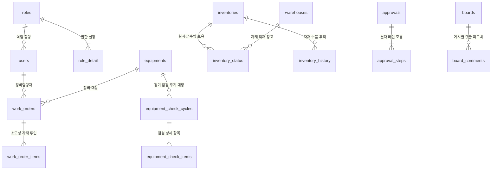

# CMMS-AGY 데이터베이스 구조 정의서 (DB Structure)

본 정의서는 시스템의 데이터베이스 아키텍처 및 테이블 릴레이션을 명세합니다. 스키마 세부 필드와 타입 정보는 단일 소스 원칙(Single Source of Truth)을 따르기 위해 백엔드의 실제 TypeORM 엔티티 클래스 파일을 직접 참조하도록 링크로 연결합니다.

---

## 0. 스키마 관리 전략 (Schema Management)

스키마의 **단일 소스는 TypeORM 엔티티**(`backend/src/entities/*.entity.ts`)이며, 환경별로 적용 방식이 다르다.

| 환경 | 방식 | 설정 | 비고 |
|------|------|------|------|
| **개발** | TypeORM `synchronize` | `DB_SYNCHRONIZE=true` (`.env`) | 엔티티 변경 시 부팅마다 DDL 자동 반영. **이력 없음**. |
| **운영** | **마이그레이션(migration)** | `NODE_ENV=production` 시 synchronize 강제 OFF | 엔티티 변경 → 마이그레이션 생성·검토·적용. **변경 이력 보존**. |

- 운영 적용 시점에 도입 예정이며, **권장은 TypeORM migrations**(엔티티 diff로 SQL 자동 생성 + `migrations` 테이블 이력)다. cmms-node 엔티티는 원본(cmms-agy)에서 이미 분기되어(예: `timestamp`→`timestamptz`) 있어, 원본 Flyway SQL 재사용보다 **현재 엔티티에서 생성**하는 편이 dev/운영 스키마 드리프트가 없다.
- `synchronize`는 운영에서 컬럼 삭제 → 데이터 유실 위험이 있어 **운영에서는 코드가 강제로 비활성**(`data-source.config.ts`)한다.
- **주의**: `synchronize`/migration 모두 **엔티티에 정의된 테이블만** 다룬다. raw SQL로만 쓰는 테이블도 전부 엔티티로 선언되어야 한다(채번 `sequence_generator`, `login_history`, `file_attachment`, `file_attachment_item` 포함 — 현재 모두 엔티티화 완료).

---

## 1. 데이터베이스 설계 원칙

### 1.1 멀티테넌트 물리 격리 구조 (`company_id`)
*   모든 트랜잭션 및 마스터 테이블은 복합 PK 또는 일반 컬럼의 맨 처음에 **`company_id`**를 가집니다.
*   모든 쿼리 실행 시 `company_id` 필터링이 누락되지 않도록 백엔드 `TenantInterceptor`가 제공하는 `TenantContext`를 의무적으로 사용합니다.

### 1.2 공통 필드 및 소프트 삭제 (`BaseEntity`)
대부분의 엔티티는 [base.entity.ts](file:///home/polknet/projects/cmms-node/backend/src/entities/base.entity.ts)를 상속받아 아래의 공통 컬럼을 유지합니다:
*   `created_at`: 레코드 생성 일시 (`timestamptz` 마이그레이션 대상)
*   `created_by`: 생성자 ID
*   `updated_at`: 레코드 최종 수정 일시
*   `updated_by`: 수정자 ID
*   `delete_yn`: 삭제 여부 (`Y`/`N` 소프트 삭제 처리용)

---

## 2. 테이블 목록 및 엔티티 매핑

각 테이블의 물리 테이블명과 대응되는 백엔드 소스 파일 링크입니다. 세부 속성은 링크된 엔티티 코드를 참고하세요.

### 2.1 기준 정보 (MDM) 및 사용자 권한
*   **회사 정보**:
    *   *테이블*: `companies` (향후 🔴 C2 복구 시 추가 대상)
*   **사용자 및 조직**:
    *   사용자 마스터: [users](file:///home/polknet/projects/cmms-node/backend/src/entities/user.entity.ts) (사용자 계정 정보, 패스워드 해시, 계정 잠금일시 등 관리)
    *   부서 마스터: [departments](file:///home/polknet/projects/cmms-node/backend/src/entities/department.entity.ts) (조직 트리 정보 구조)
    *   공장 마스터: [plants](file:///home/polknet/projects/cmms-node/backend/src/entities/plant.entity.ts) (소속 공장 단위)
*   **역할 및 인가 권한 매트릭스**:
    *   역할 마스터: [roles](file:///home/polknet/projects/cmms-node/backend/src/entities/role.entity.ts) (`ADMIN`, `MANAGER` 등 역할 그룹)
    *   역할별 권한 매핑: [role_detail](file:///home/polknet/projects/cmms-node/backend/src/entities/role-detail.entity.ts) (모듈별 C/R/U/D/A 권한 플래그값 보관)
*   **창고 및 공통 코드**:
    *   자재 보관 창고: [warehouses](file:///home/polknet/projects/cmms-node/backend/src/entities/warehouse.entity.ts)
    *   공통코드 그룹: [code_groups](file:///home/polknet/projects/cmms-node/backend/src/entities/code-group.entity.ts)
    *   공통코드 세부항목: [code_items](file:///home/polknet/projects/cmms-node/backend/src/entities/code-item.entity.ts)

### 2.2 자산 및 정비 마스터
*   **설비 자산**:
    *   설비 정보: [equipments](file:///home/polknet/projects/cmms-node/backend/src/entities/equipment.entity.ts)
*   **예방 정비 기준 설정**:
    *   설비별 정기 점검 주기: [equipment_check_cycles](file:///home/polknet/projects/cmms-node/backend/src/entities/equipment-check-cycle.entity.ts)
    *   점검 항목 및 상한/하한값 세부 기준: [equipment_check_items](file:///home/polknet/projects/cmms-node/backend/src/entities/equipment-check-item.entity.ts)

### 2.3 재고 수불 및 마감 (Inventory)
*   **재고 정보**:
    *   자재 품목 정보: [inventories](file:///home/polknet/projects/cmms-node/backend/src/entities/inventory.entity.ts)
    *   창고별 실시간 재고량/단가 현황: [inventory_status](file:///home/polknet/projects/cmms-node/backend/src/entities/inventory-status.entity.ts)
*   **수불 이력 및 마감**:
    *   자재 입출고 수불 히스토리: [inventory_history](file:///home/polknet/projects/cmms-node/backend/src/entities/inventory-history.entity.ts)
    *   자재 월말 마감 대장: [inventory_monthly_closings](file:///home/polknet/projects/cmms-node/backend/src/entities/inventory-monthly-closing.entity.ts)

### 2.4 설비 정비 및 보전 업무 (Maintenance & Safety)
*   **작업 오더 (Work Order)**:
    *   작업 오더 헤더: [work_orders](file:///home/polknet/projects/cmms-node/backend/src/entities/work-order.entity.ts) (정비 비용, 공수시간 집계)
    *   작업 오더 내 소요 품목 세부: [work_order_items](file:///home/polknet/projects/cmms-node/backend/src/entities/work-order-item.entity.ts)
*   **예방 정비 기록 (PM)**:
    *   예방 정비 점검 기록 헤더: [pm_records](file:///home/polknet/projects/cmms-node/backend/src/entities/pm-record.entity.ts)
    *   점검 항목별 계측치 실적: [pm_record_items](file:///home/polknet/projects/cmms-node/backend/src/entities/pm-record-item.entity.ts)
*   **안전 작업 및 LOTO (Safety)**:
    *   안전 작업 허가서 및 LOTO 이력: [work_permits](file:///home/polknet/projects/cmms-node/backend/src/entities/work-permit.entity.ts)

### 2.5 구매 의뢰 (Procurement)
*   구매 요청서 헤더: [purchase_requests](file:///home/polknet/projects/cmms-node/backend/src/entities/purchase-request.entity.ts)
*   구매 요청 품목 세부: [purchase_request_items](file:///home/polknet/projects/cmms-node/backend/src/entities/purchase-request-item.entity.ts)

### 2.6 전자 결재 (E-Approval)
*   결재문서 마스터: [approvals](file:///home/polknet/projects/cmms-node/backend/src/entities/approval.entity.ts)
*   결재 단계별 진행선/결과: [approval_steps](file:///home/polknet/projects/cmms-node/backend/src/entities/approval-step.entity.ts)

### 2.7 커뮤니티 및 게시판
*   게시글 정보: [boards](file:///home/polknet/projects/cmms-node/backend/src/entities/board.entity.ts)
*   게시글 댓글: [board_comments](file:///home/polknet/projects/cmms-node/backend/src/entities/board-comment.entity.ts)

---

## 3. 핵심 관계 구조 (ERD 요약)

