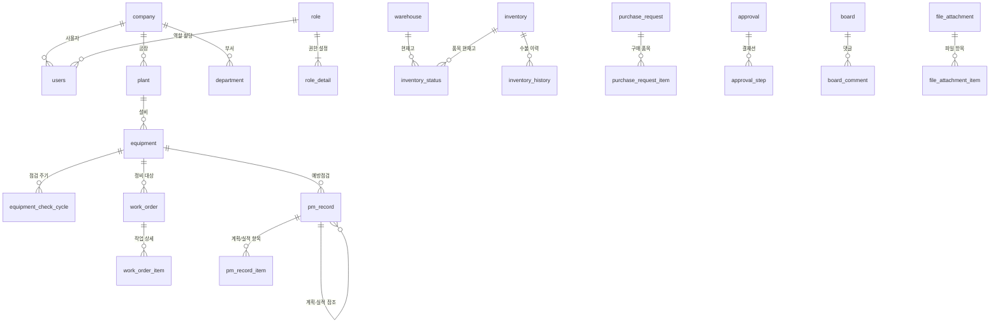

# CMMS-NODE 데이터베이스 구조 정의서

세부 컬럼, 타입, PK 구성은 백엔드 TypeORM 엔티티(`backend/src/entities/*.entity.ts`)를 기준으로 합니다. 본 문서는 테이블 목록, 역할, 설계 주의사항만 요약합니다.

---

## 1. 스키마 관리

| 환경 | 방식 | 설정 | 주의사항 |
|------|------|------|----------|
| 개발 | TypeORM `synchronize` | `.env`의 `NODE_ENV=development`, `DB_SYNCHRONIZE=true` | 엔티티 기준으로 DDL 자동 반영. 변경 이력은 남지 않음. |
| 운영 | 마이그레이션 | `NODE_ENV=production` | 코드상 synchronize 강제 비활성. 운영 DDL은 별도 마이그레이션 절차로 적용. |

주의사항:
- 스키마의 단일 소스는 TypeORM 엔티티입니다.
- 운영 DB에서 `synchronize`를 사용하지 않습니다. 컬럼 삭제 등 데이터 유실 위험이 있습니다.
- raw SQL로 접근하는 테이블도 반드시 엔티티로 선언되어야 합니다.
- 실제 테이블명은 엔티티의 `@Entity(...)` 값을 기준으로 합니다.

---

## 2. 설계 원칙

### 2.1 테넌트 격리
- 업무 데이터는 `company_id` 기준으로 회사별 격리합니다.
- 플랜트 단위 업무 데이터는 `plant_id`를 함께 사용합니다.
- 서비스 쿼리는 `TenantContext`의 `companyId`를 기준으로 조회해야 합니다.
- `company` 테이블은 최상위 테넌트 마스터이므로 `company_id`를 별도 컬럼으로 갖지 않습니다.

### 2.2 공통 컬럼
대부분의 마스터/업무 엔티티는 공통 컬럼을 가집니다.

- `created_at`
- `created_by`
- `updated_at`
- `updated_by`
- `delete_yn`

주의사항:
- 조회 쿼리는 원칙적으로 `delete_yn = 'N'` 조건을 포함합니다.
- 시간 컬럼은 `timestamptz` 기준으로 관리합니다.
- 금액/수량 등 정밀 값은 `numeric`과 Decimal 처리를 기준으로 합니다.

---

## 3. 테이블 목록

### 3.1 테넌트, 사용자, 권한

| 테이블 | 설명 |
|--------|------|
| `company` | 회사/테넌트 마스터. `SYSTEM` 회사는 플랫폼 관리용 예외 테넌트입니다. |
| `users` | 사용자 계정, 비밀번호 해시, 계정 잠금, 마지막 로그인 플랜트 정보. |
| `login_history` | 로그인 성공/실패 이력. |
| `plant` | 회사 내 공장/플랜트 마스터. |
| `department` | 부서/조직 마스터. |
| `role` | 회사별 권한 그룹. 일반 회사는 `ADMIN`, `MANAGER`, `PURCHASER`, `USER` 기본 생성. |
| `role_detail` | 권한 그룹별 모듈 권한 매트릭스. `perm_c/r/u/d/a`를 저장. |

주의사항:
- `SYSTEM` 역할은 플랫폼 전용이며 일반 회사에 생성/할당하지 않습니다.
- 권한 대상 모듈은 `AppModule` 상수가 단일 소스입니다. 모듈 코드를 `code_group`에 중복 저장하지 않습니다.
- 신규 회사 생성 시 기본 Role과 `role_detail`이 자동 생성됩니다. 초기 권한은 모두 `Y`로 생성하고 회사 담당자가 권한관리에서 보정합니다.

### 3.2 기준 정보와 공통 코드

| 테이블 | 설명 |
|--------|------|
| `warehouse` | 자재 보관 창고. 플랜트 하위 또는 공통 창고로 사용할 수 있습니다. |
| `code_group` | 회사별 업무 공통코드 그룹. |
| `code_item` | 코드그룹별 코드 아이템. |
| `equipment` | 설비 마스터. |
| `equipment_check_cycle` | 설비별 예방점검 주기. |
| `pm_check_template` | 점검 항목 템플릿 (점검유형별). |
| `inventory` | 자재/품목 마스터. |

주의사항:
- 신규 회사 생성 시 기본 `code_group`/`code_item`이 자동 생성됩니다.
- 기본 코드 예: `EQ_TYPE`, `INV_TYPE`, `PM_TYPE`, `WO_TYPE`, `WP_TYPE`, `PR_TYPE`.
- 업무 코드 값은 참조 무결성을 위해 쓰기 시 유효성 검증이 필요합니다.

### 3.3 재고

| 테이블 | 설명 |
|--------|------|
| `inventory_status` | 창고별 현재 재고 수량, 금액, 이동평균단가. |
| `inventory_history` | 입고, 출고, 이동, 조정 이력. |
| `inventory_monthly_closing` | 월말 재고 마감 결과. |

주의사항:
- 동일 창고-품목 수불은 비관적 락(`FOR UPDATE NOWAIT`) 기준으로 처리합니다.
- 출고와 이동 출고 수량/금액은 음수로 기록합니다.
- 월마감은 현재고 복사가 아니라 마감월 말일까지의 이력 합산으로 계산합니다.

### 3.4 보전 업무

| 테이블 | 설명 |
|--------|------|
| `work_order` | 작업지시서 헤더. |
| `work_order_item` | 작업지시별 작업/소요 품목 상세. |
| `pm_record` | 예방점검 계획/실적 헤더. `step_stage`로 계획(`P`)과 실적(`R`)을 구분. 계획 전용 필드: `title`, `cycle_from`, `cycle_end`, `close_yn`. 실적은 `ref_module='PM'`, `ref_no=<계획번호>`로 계획 참조. |
| `pm_record_item` | 예방점검 계획/실적 공용 항목. 계획은 기준값(min/max/base), 실적은 측정값(check_value) 저장. |
| `pm_check_template` | 점검 항목 템플릿. 점검유형별 기본 항목 정의. 계획 생성 시 템플릿에서 불러오기 가능. |
| `work_permit` | 안전작업허가서 및 LOTO 관련 체크 정보. |

주의사항:
- 보전 업무 테이블은 `company_id`와 `plant_id`를 함께 사용합니다.
- 단일 플랜트 사용자는 `users.last_login_plant_id` 기준 플랜트만 접근해야 합니다.
- 멀티 플랜트 사용자는 요청 플랜트 기준으로 접근합니다.
- 예방점검 주기는 실적(`step_stage='R'`)이 확정될 때만 갱신합니다. 계획 확정은 주기를 갱신하지 않습니다.

### 3.5 구매

| 테이블 | 설명 |
|--------|------|
| `purchase_request` | 구매요청 헤더. |
| `purchase_request_item` | 구매요청 품목 상세. |

주의사항:
- 구매요청은 현재 결재 모듈과 직접 cascade 연계하지 않습니다.
- 문서 상태(`status`)와 구매 진행상태(`proc_status`)는 별도 축입니다.
- 입고 처리 시 재고 수불과 연결됩니다.

### 3.6 전자결재

| 테이블 | 설명 |
|--------|------|
| `approval` | 결재 문서 헤더. |
| `approval_step` | 결재선, 결재자, 단계 결과. |

주의사항:
- 결재 상태 전이와 연계 문서 상태 전이는 같은 트랜잭션에서 처리합니다.
- 현재 결재 cascade 대상은 `WO`, `WP`, `PM`입니다.
- 구매요청(`PUR`)은 결재 cascade 대상이 아닙니다.

### 3.7 게시판과 파일

| 테이블 | 설명 |
|--------|------|
| `board` | 게시글. |
| `board_comment` | 게시글 댓글. |
| `file_attachment` | 파일 그룹/첨부 메타 헤더. |
| `file_attachment_item` | 파일 개별 항목. |

주의사항:
- 게시글은 소프트 삭제합니다.
- 첨부파일은 DB 메타데이터와 외부 Object Storage 객체의 정합성을 함께 고려해야 합니다.

### 3.8 시스템 보조

| 테이블 | 설명 |
|--------|------|
| `sequence_generator` | 모듈별 문서번호 채번 상태. |

주의사항:
- 문서번호는 DB 원자 연산 기준으로 생성해야 합니다.
- 모듈 코드는 `AppModule` 상수를 기준으로 합니다.

---

## 4. 핵심 관계 요약

