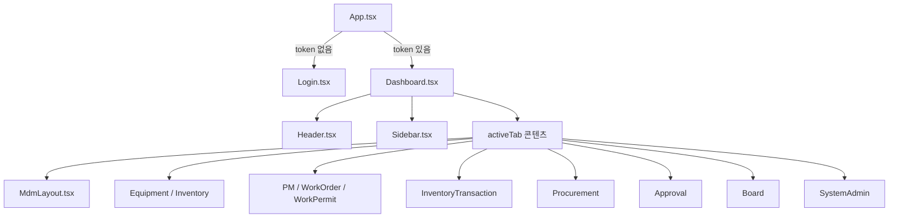

# CMMS-NODE UI 구조 정의서

본 문서는 프론트엔드의 현재 화면 구성, 상태 관리, 운영 시 주의사항을 요약합니다.
세부 구현은 `frontend/src` 하위 소스 코드를 기준으로 확인합니다.

---

## 1. 기술 스택

*   Vite 8
*   React 19
*   TypeScript
*   Zustand 5
*   TailwindCSS 4
*   Axios
*   Sonner

주의사항:
*   현재 라우팅 라이브러리는 사용하지 않습니다.
*   `App.tsx`에서 인증 토큰 존재 여부로 `Login` 또는 `Dashboard`를 조건부 렌더링합니다.
*   로그인 이후 화면 전환은 `Dashboard` 내부 `activeTab` 상태와 `Sidebar` 메뉴 선택으로 처리합니다.

---

## 2. 상태 관리

### 2.1 인증 상태

*   스토어: `frontend/src/store/useAuthStore.ts`
*   주요 상태: `user`, `token`, `expiresAt`, `timeRemaining`, `activePlantId`
*   세션 저장: `sessionStorage` 기반으로 토큰과 사용자 정보를 복원합니다.
*   API 인증: 로그인 또는 세션 복원 시 Axios 기본 `Authorization` 헤더를 설정합니다.

주의사항:
*   `lastLoginPlantId`는 서버에서 내려오는 사용자 기준 공장입니다.
*   `activePlantId`는 화면에서 현재 선택한 공장 상태입니다.
*   로그인 시 `activePlantId`는 `lastLoginPlantId`로 초기화됩니다.
*   멀티 플랜트 사용자는 헤더에서 공장을 전환할 수 있습니다.

### 2.2 테마 상태

*   스토어: `frontend/src/store/useThemeStore.ts`
*   라이트/다크 모드를 관리합니다.
*   선택값은 `localStorage`에 저장합니다.

---

## 3. API 통신

*   공통 Axios 인스턴스: `frontend/src/api/axios.ts`
*   기본 `baseURL`: `/api`
*   `VITE_API_BASE_URL` 설정 시 API 주소를 오버라이드합니다.

주의사항:
*   개발 환경은 Vite 프록시 또는 `/api` 상대 경로 구성을 전제로 합니다.
*   운영 환경은 Nginx 또는 배포 프록시가 `/api` 요청을 백엔드로 전달해야 합니다.
*   401 응답 발생 시 인증 스토어에서 로그아웃 처리를 수행합니다.

---

## 4. 화면 구성

### 4.1 인증 및 공통 화면

| 화면 | 설명 |
| --- | --- |
| Login | 회사 ID, 사용자 ID, 비밀번호로 로그인합니다. ID 저장 옵션을 제공합니다. |
| Dashboard | 로그인 후 공통 셸입니다. Header, Sidebar, 콘텐츠 영역을 포함합니다. |
| MyPage | 프로필 조회/수정 및 비밀번호 변경을 처리합니다. |

주의사항:
*   최초 로그인 또는 비밀번호 만료 사용자는 `PasswordChangeNotice` 모달을 통해 비밀번호 변경을 안내합니다.
*   대시보드 카드 값은 현재 정적 요약값입니다. 실시간 집계가 필요하면 별도 API 연동이 필요합니다.

### 4.2 업무 화면

| 탭 ID | 화면 | 설명 |
| --- | --- | --- |
| `mdm` | MdmLayout | 공장, 부서, 역할/권한, 사용자, 창고, 공통코드를 관리합니다. |
| `equipment` | Equipment | 설비 마스터와 점검 기준을 관리합니다. |
| `inventory` | Inventory | 자재 품목 마스터를 관리합니다. |
| `stock` | InventoryTransaction | 재고 수불, 이동, 조정, 월마감을 처리합니다. |
| `pm` | PreventiveMaintenance | 예방정비 계획과 점검 실적을 처리합니다. |
| `wo` | WorkOrder | 작업 오더 등록, 실적, 출력 기능을 제공합니다. |
| `wp` | WorkPermit | 안전작업허가서와 LOTO 관련 업무를 처리합니다. |
| `procurement` | Procurement | 구매요청, 발주, 출하, 입고 업무를 처리합니다. |
| `approval` | Approval | 결재함 조회, 상신, 승인, 반려를 처리합니다. |
| `board` | Board | 게시글과 댓글을 관리합니다. |
| `system` | SystemAdmin | SYSTEM 사용자 전용 회사 생성, 사용자 활성화, 로그인 이력 조회 화면입니다. |

주의사항:
*   메뉴 노출과 화면 진입 제어는 프론트엔드 상태만으로 보장하면 안 됩니다.
*   실제 권한 검증은 백엔드 `@Permission` 가드가 최종 기준입니다.
*   `system` 화면은 SYSTEM 회사 사용자만 사용하는 플랫폼 관리 화면으로 취급합니다.

---

## 5. 레이아웃 구조

주의사항:
*   현재 구조는 URL 기반 라우팅이 아니므로 새로고침 시 선택 탭은 기본 대시보드로 돌아갑니다.
*   특정 화면을 URL로 직접 공유해야 한다면 React Router 도입 또는 탭 상태의 URL 동기화가 필요합니다.
*   인쇄 기능은 업무별 전용 출력 컴포넌트와 브라우저 `window.print()` 흐름을 사용합니다.
