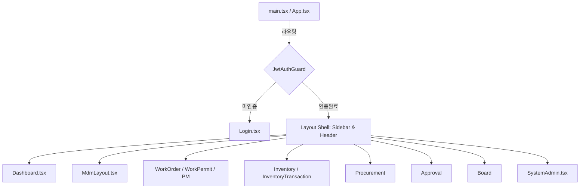

# CMMS-AGY UI 구조 정의서 (UI Structure)

본 정의서는 프론트엔드 어플리케이션의 아키텍처, 상태 관리 및 페이지 화면 구조를 명세합니다.

---

## 1. 프론트엔드 기술 아키텍처

### 1.1 기술 스택
*   **Vite 8**: 고속 번들링 및 HMR(Hot Module Replacement) 지원
*   **React 19**: 컴포넌트 기반 웹 애플리케이션 라이브러리
*   **Zustand 5**: 경량 상태 관리 프레임워크 (세션 데이터 저장 및 구독)
*   **TailwindCSS**: Utility-first CSS 프레임워크 (반응형 및 테마 지원)

### 1.2 상태 관리 (Zustand Stores)
*   **인증 및 컨텍스트 스토어**: [useAuthStore.ts](file:///home/polknet/projects/cmms-node/frontend/src/store/useAuthStore.ts)
    *   로그인 사용자 세션 정보(`user`), JWT `token`, 권한 리스트 등을 보관합니다.
    *   사용자의 활성 공장 정보(`activePlantId`) 및 토큰 절대 만료 타임스탬프(`expiresAt`)를 PERSIST 캐싱하여 모듈 간 공유 및 자동 로그아웃 처리를 수행합니다.
*   **테마 및 UI 스토어**: [useThemeStore.ts](file:///home/polknet/projects/cmms-node/frontend/src/store/useThemeStore.ts)
    *   시스템 라이트/다크 테마 설정을 전역적으로 전파합니다.

---

## 2. 화면 구성 및 페이지 라우팅

각 화면은 백엔드 API 서비스와 통신하며 단위 보전 업무 화면을 형성합니다. 모든 실제 뷰 소스 코드는 아래 링크를 통해 직접 접근할 수 있습니다.

### 2.1 인증 및 시스템 대시보드
*   **로그인 화면**: [Login.tsx](file:///home/polknet/projects/cmms-node/frontend/src/pages/Login.tsx)
    *   사용자 사번/비밀번호 입력 및 최초 로그인 시 강제 비밀번호 변경 흐름(must_change_password)을 제어합니다.
*   **종합 대시보드**: [Dashboard.tsx](file:///home/polknet/projects/cmms-node/frontend/src/pages/Dashboard.tsx)
    *   부서별 작업 오더 진행 현황, 결재 대기 건수, 긴급 정비 설비 목록 요약을 제공합니다.
*   **마이페이지**: [MyPage.tsx](file:///home/polknet/projects/cmms-node/frontend/src/pages/MyPage.tsx)
    *   비밀번호 변경 및 개인 프로필 관리를 지원합니다.

### 2.2 기준 정보 관리 (MDM)
*   **기준 정보 관리 통합 탭 레이아웃**: [MdmLayout.tsx](file:///home/polknet/projects/cmms-node/frontend/src/pages/MdmLayout.tsx)
    *   공장(Plants), 부서(Departments), 권한 역할(Roles), 사용자 관리(Users), 창고(Warehouses), 공통 코드(Common Codes)의 6가지 탭 화면을 단일 페이지 내 동적 탭 렌더링으로 묶어 기준 정보를 원스톱으로 관리합니다.

### 2.3 자재 및 재고 관리
*   **실시간 재고 현황**: [Inventory.tsx](file:///home/polknet/projects/cmms-node/frontend/src/pages/Inventory.tsx)
    *   창고별 재고 수량/금액 상세 모니터링 및 월 마감 일괄 처리 컨트롤러 인터페이스를 제공합니다.
*   **자재 수불 이력**: [InventoryTransaction.tsx](file:///home/polknet/projects/cmms-node/frontend/src/pages/InventoryTransaction.tsx)
    *   자재 입고(IN), 출고(OUT), 이동(MOVE), 재고실사 조정(ADJ)을 지시하고 히스토리를 추적합니다.
*   **설비 자산 현황**: [Equipment.tsx](file:///home/polknet/projects/cmms-node/frontend/src/pages/Equipment.tsx)
    *   설비 리스트 조회, 상세 사양 등록 및 주기별 점검 스펙을 설정합니다.

### 2.4 설비 정비 및 예방 보전 (Maintenance)
*   **작업 오더 (Work Order)**: [WorkOrder.tsx](file:///home/polknet/projects/cmms-node/frontend/src/pages/WorkOrder.tsx)
    *   정비 접수, 작업 지시서 작성, 실적(소요 비용, 공수) 등록 및 현장 출력 기능을 관리합니다.
*   **안전 작업 허가서 & LOTO**: [WorkPermit.tsx](file:///home/polknet/projects/cmms-node/frontend/src/pages/WorkPermit.tsx)
    *   정비 안전 규칙 체크리스트 점검 및 LOTO 태그 등록 프로세스 화면입니다.
*   **예방 정비 (PM)**: [PreventiveMaintenance.tsx](file:///home/polknet/projects/cmms-node/frontend/src/pages/PreventiveMaintenance.tsx)
    *   점검 주기 기반 PM 계획 및 점검 결과 계측 실적을 합격/불합격 판정합니다.

### 2.5 구매, 결재 및 소통 (Procurement & E-Approval)
*   **구매 의뢰**: [Procurement.tsx](file:///home/polknet/projects/cmms-node/frontend/src/pages/Procurement.tsx)
    *   보전용 신규 자재 구매 요청 상신 및 인쇄용 폼 출력을 지원합니다.
*   **전자 결재함**: [Approval.tsx](file:///home/polknet/projects/cmms-node/frontend/src/pages/Approval.tsx)
    *   상신함, 미결함, 참조함, 종결결재 목록을 확인하고 결재 승인/반려 처리를 수행합니다.
*   **사내 게시판**: [Board.tsx](file:///home/polknet/projects/cmms-node/frontend/src/pages/Board.tsx)
    *   정비 공지 게시판 및 댓글을 통한 부서 간 소통 피드를 렌더링합니다.

### 2.6 플랫폼 시스템 관리자 전용
*   **시스템 통합 관리 화면**: [SystemAdmin.tsx](file:///home/polknet/projects/cmms-node/frontend/src/pages/SystemAdmin.tsx)
    *   신규 테넌트(회사) 가입 생성, 플랫폼 전체 가용 유저 활성여부 제어, 로그인 감사 로그 추적을 위한 슈퍼어드민 콘솔입니다.

---

## 3. UI 컴포넌트 및 레이아웃 아키텍처

*   **Shell 레이아웃**: 프론트엔드의 공통 사이드바(메뉴 이동)와 헤더(알림, 공장 전환, 마이페이지 이동, 다크모드 제어)를 단일 쉘로 감싸 라우팅 전환 시 렌더링 부하를 최소화합니다.
*   **인쇄 지원**: 모든 보전 인쇄 기능은 브라우저 기본 `window.print()`를 트리거하며, Tailwind의 `@media print` variant를 통해 다크 모드를 자동 보정하고 사이드바 등의 불필요 UI를 숨겨 인쇄 규격을 강제합니다.
